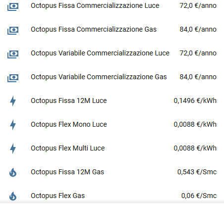

# 🐙 Octopus Tariffe - Home Assistant Custom Component

Un'integrazione personalizzata, ultra-stabile e invisibile per Home Assistant che estrae in tempo reale i **costi fissi di commercializzazione (PCV/QVD)** e i **prezzi della materia prima** dal sito ufficiale di [Octopus Energy Italia](https://octopusenergy.it/le-nostre-tariffe).

  

## 🌟 A cosa ti serve questa integrazione?

Su Home Assistant ci sono già ottime integrazioni per monitorare i consumi e i costi del tuo *attuale* contratto. Ma come fai a sapere se sul sito di Octopus è uscita una tariffa più bassa e ti conviene cambiare piano?

Questa integrazione colma questa lacuna: estrae automaticamente i **prezzi pubblici attuali** dal sito di Octopus e li porta direttamente sulla tua dashboard.

I suoi punti di forza:
* **Zero Codice:** Non devi toccare nessun file complicato. Si configura tutto dall'interfaccia grafica di Home Assistant in soli 2 clic.
* **Leggerissima:** Controlla i prezzi in background solo 2 volte al giorno. Avrai i dati sempre aggiornati senza appesantire minimamente il tuo Home Assistant.

**Ho Realizzato una Card per utilizzare al meglio i seguenti sensori la trovi qui:** https://github.com/SalvatoreITA/DomHouse-Octopus-Card

---

## 📊 Sensori Creati (9 Entità)

L'integrazione crea automaticamente due categorie di sensori, estraendo i valori precisi al centesimo delle tariffe Fissa 12M e Flex:

### 💰 Costi Fissi (PCV / QVD)
I costi di commercializzazione, già calcolati su base annuale:
* `sensor.octopus_fissa_commercializzazione_luce` (€/anno)
* `sensor.octopus_fissa_commercializzazione_gas` (€/anno)
* `sensor.octopus_variabile_commercializzazione_luce` (€/anno)
* `sensor.octopus_variabile_commercializzazione_gas` (€/anno)

### ⚡ Materia Prima (Energia / Spread)
Il costo nudo dell'energia o lo spread per le tariffe indicizzate:
* `sensor.octopus_fissa_12m_luce` (€/kWh)
* `sensor.octopus_fissa_12m_gas` (€/Smc)
* `sensor.octopus_flex_mono_luce` (€/kWh)
* `sensor.octopus_flex_multi_luce` (€/kWh)
* `sensor.octopus_flex_gas` (€/Smc)

---

## 📥 Installazione tramite HACS (Consigliata)

Il metodo più semplice e veloce per installare l'integrazione e mantenerla aggiornata.

1. Apri **HACS** nel tuo Home Assistant.
2. Clicca sui tre puntini in alto a destra e seleziona **Repository personalizzati**.
3. Incolla l'URL di questo repository: `https://github.com/SalvatoreITA/Octopus-Italy-Tariffe`
4. Come categoria scegli **Integrazione**.
5. Clicca su **Aggiungi**.
6. Cerca "Octopus Tariffe" in HACS, scaricala e **riavvia Home Assistant**.

---

## ⚙️ Configurazione

Questa integrazione si installa in modo 100% visivo!

1. Vai su **Impostazioni** > **Dispositivi e servizi**.
2. Clicca sul pulsante in basso a destra **+ AGGIUNGI INTEGRAZIONE**.
3. Cerca **Octopus Tariffe**.
4. Clicca su Invia nella finestra che ti appare. Fatto! I tuoi 9 sensori sono immediatamente pronti all'uso.

## ☕ Supporta il Progetto

Ogni piccolo supporto fa un'enorme differenza: mi aiuta a mantenere vivo l'entusiasmo e mi stimola a creare e condividere nuove soluzioni per la community. Grazie di cuore per il tuo aiuto! 🚀

## ❤️ Crediti
Sviluppato da [Salvatore Lentini - DomHouse.it](https://www.domhouse.it)
